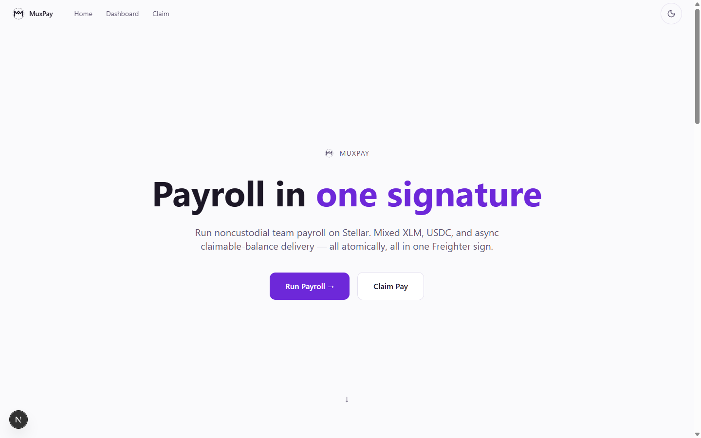
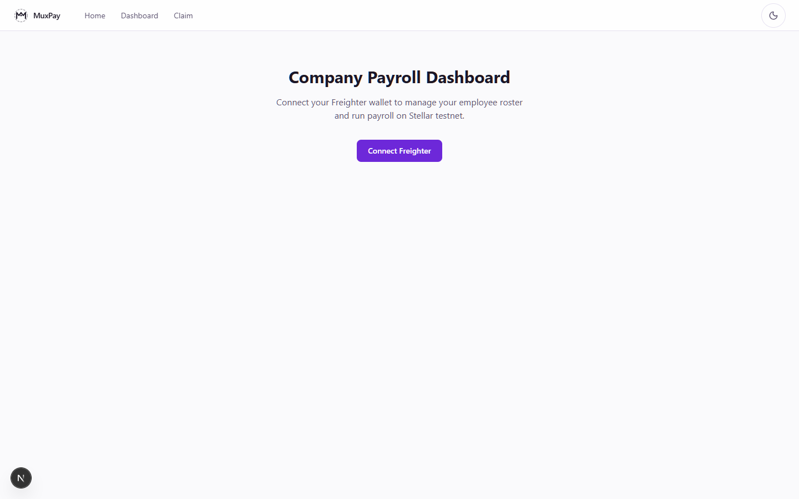
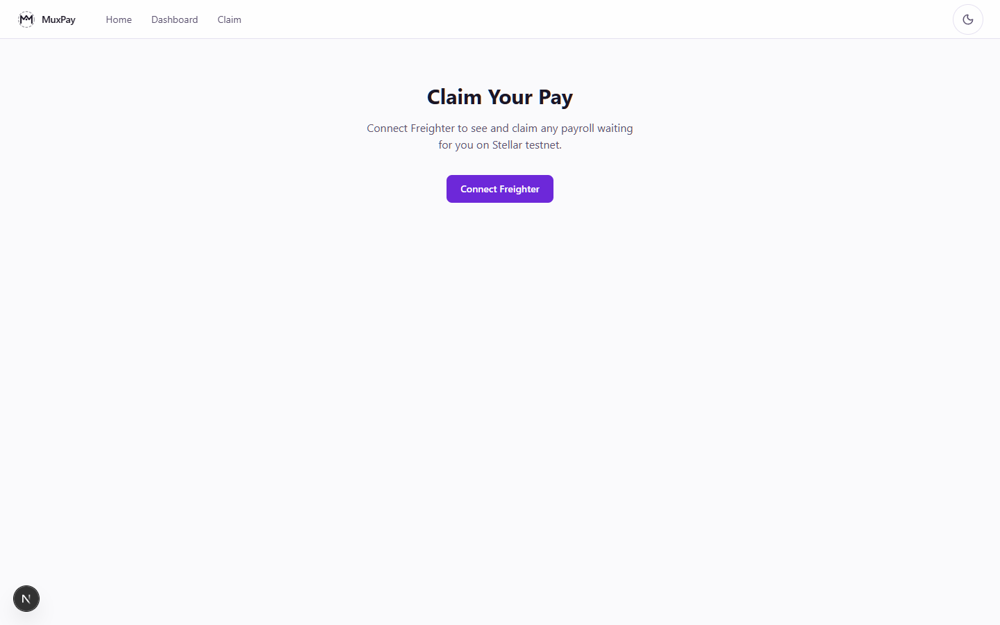

# MuxPay — Payroll in One Signature

> Noncustodial team payroll on Stellar. Pay your entire roster — mixed XLM and USDC, sync and async — in a single Freighter signature. No backend. No custodian. No blocked runs.



---

## Table of Contents

- [What It Does](#what-it-does)
- [How It Uses Stellar](#how-it-uses-stellar)
- [Tech Stack](#tech-stack)
- [Prerequisites](#prerequisites)
- [Quick Start](#quick-start)
- [App Structure](#app-structure)
- [Pages & User Flows](#pages--user-flows)
- [Key Concepts](#key-concepts)
- [Available Scripts](#available-scripts)
- [Environment & Network](#environment--network)
- [Demo Script](#demo-script)
- [Architecture Notes](#architecture-notes)
- [Roadmap / Non-Goals](#roadmap--non-goals)
- [License](#license)

---

## What It Does

MuxPay is a **noncustodial payroll dApp** running on the Stellar testnet. A company admin connects their [Freighter](https://www.freighter.app/) wallet — no account signup, no database — and the wallet address becomes the company identity.

Three surfaces:

| Route | Who uses it | Purpose |
|---|---|---|
| `/` | Anyone | GSAP scroll-driven landing — product story + CTA |
| `/dashboard` | Employer | Manage roster, view balance, run payroll, see history |
| `/dashboard/run` | Employer | 4-step run wizard: select → preflight → sign → result |
| `/claim` | Employee | See and redeem pending claimable balances |

**The golden path:**

1. Add employees (name, Stellar address, salary, asset).
2. Click **Run Payroll** — the app preflights each recipient and decides the best delivery method automatically.
3. Review the per-employee preview with costs and delivery badges.
4. Sign **once** in Freighter — one multi-op transaction for the whole roster.
5. Employees who received claimable balances claim them later from `/claim`.

All state lives in `localStorage` keyed by the employer's wallet address. No funds ever touch a custodian.

---

## How It Uses Stellar

MuxPay uses five distinct Stellar primitives:

| # | Operation | When used |
|---|---|---|
| 1 | `Payment` | Recipient account funded, correct trustline present (XLM payroll) |
| 2 | `PathPaymentStrictReceive` | Recipient funded with USDC trustline — DEX converts XLM → USDC |
| 3 | `CreateClaimableBalance` | Recipient account not funded **or** missing trustline — async delivery |
| 4 | `ClaimClaimableBalance` | Employee claims their balance from `/claim` |
| 5 | `ChangeTrust` | Auto-prepended to a USDC claim tx when employee lacks the trustline |

**All employer operations land in one classic multi-op transaction. One Freighter signature. Atomic.**

The employer-side claimable balance predicate includes a 7-day reclaim window:

```
claimant:  employee address  (can claim anytime)
reclaim:   predicateNot(predicateBeforeRelativeTime("604800"))
```

---

## Tech Stack

| Layer | Technology |
|---|---|
| Framework | Next.js 16 (App Router) |
| UI | React 19, Tailwind CSS v4 |
| Animations | GSAP 3 + `@gsap/react` (ScrollTrigger) |
| Theme | `next-themes` — dark / light / system, persisted |
| Wallet | `@stellar/freighter-api` v6 |
| Blockchain SDK | `@stellar/stellar-sdk` v15 |
| Icons | `lucide-react` |
| Fonts | Inter + Space Grotesk (via `next/font`) |
| Storage | Browser `localStorage` — no backend, no database |
| Language | TypeScript 5 |
| Network | Stellar **testnet** |

---

## Prerequisites

- **Node.js 20+** and **npm 10+**
- **[Freighter browser extension](https://www.freighter.app/)** — the Stellar wallet used for all signing
  - Switch it to **Testnet** before using the app
- A funded testnet account — get free XLM from [Stellar Friendbot](https://friendbot.stellar.org/?addr=YOUR_ADDRESS)

---

## Quick Start

```bash
# 1. Clone
git clone https://github.com/QuackyPROG/MuxPay-Splitter.git
cd mux-pay/web

# 2. Install
npm install

# 3. Run
npm run dev
# → http://localhost:3000
```

No `.env` required. The app points to Stellar testnet endpoints by default.

**Freighter setup (if new to Stellar):**

1. Install the [Freighter extension](https://www.freighter.app/)
2. Create or import a wallet
3. Open Freighter → Settings → Network → switch to **Testnet**
4. Fund your address: `https://friendbot.stellar.org/?addr=YOUR_G_ADDRESS`

---

## App Structure

```
mux-pay/
├── web/                            ← Next.js app (all frontend code)
│   ├── src/
│   │   ├── app/
│   │   │   ├── layout.tsx              Root layout — ThemeProvider, fonts
│   │   │   ├── page.tsx                Landing page (scroll story)
│   │   │   ├── LandingAnimations.tsx   GSAP client component (lazy)
│   │   │   ├── globals.css             Tailwind base + CSS custom properties
│   │   │   ├── dashboard/
│   │   │   │   ├── page.tsx            Employer dashboard (metadata only)
│   │   │   │   ├── DashboardClient.tsx Wallet + roster + history UI
│   │   │   │   └── run/
│   │   │   │       ├── page.tsx        Run wizard shell
│   │   │   │       └── RunPageClient.tsx
│   │   │   └── claim/
│   │   │       ├── page.tsx            Employee claim portal shell
│   │   │       └── ClaimPageClient.tsx
│   │   ├── components/
│   │   │   ├── landing/                Hero, Problem, HowItWorks, Proof, Cta
│   │   │   ├── payroll/                EmployeeTable, EmployeeForm(Modal), RunWizard,
│   │   │   │                           RunPreview, RunHistory, CsvImport
│   │   │   ├── claim/                  ClaimList
│   │   │   ├── brand/                  Logo, EmptyState, FlowIllustration
│   │   │   ├── muxpay/                 StatusPanel, Preview, RecipientEditor
│   │   │   ├── AppHeader.tsx
│   │   │   ├── ConnectWallet.tsx
│   │   │   └── ThemeToggle.tsx
│   │   ├── hooks/
│   │   │   └── useWallet.ts            Freighter connection state machine
│   │   └── lib/
│   │       ├── stellar.ts              Horizon client, network constants
│   │       ├── balances.ts             Fetch XLM / USDC balances
│   │       ├── batch.ts                Build + submit multi-op transactions
│   │       ├── claims.ts               Fetch claimable balances + build claim XDR
│   │       ├── pathfinder.ts           DEX path lookup (XLM → USDC)
│   │       ├── preflight.ts            Per-employee delivery method decision
│   │       ├── storage.ts              localStorage read/write (employees, runs)
│   │       ├── trustline.ts            Check / add USDC trustline
│   │       ├── muxed.ts                Muxed account encoding
│   │       └── types.ts                Shared TypeScript types
├── contracts/
│   └── savings-goal/                  Example Soroban contract (reference only)
├── specs/
│   ├── 001-muxpay-splitter/           Prior MVP spec (complete)
│   └── 002-payroll-webapp/            Active feature spec, plan, data model
└── docs/
    └── screenshots/                   App screenshots (Playwright)
```

---

## Pages & User Flows

### `/` — Landing Page


A scroll-driven product story with five sections: **Hero → Problem → How It Works → Stellar Proof → CTA**. GSAP ScrollTrigger powers pinned sections and scrubbed reveals. Animations respect `prefers-reduced-motion`. The page is readable without JavaScript.

The header links directly to `/dashboard` ("Run Payroll") and `/claim` ("Claim Pay").

---

### `/dashboard` — Employer Dashboard



Connect Freighter to unlock the workspace. Once connected:

- **Balance panel** — live XLM and USDC balances fetched from Horizon
- **Employee roster** — full CRUD (name, Stellar address, salary, asset, member ID, active toggle)
- **CSV import** — paste or upload a CSV: `name,address,salary,asset`
- **Run Payroll** button — appears when ≥ 1 active employee exists
- **Payroll history** — every past run with tx hash, Stellar Expert link, and per-employee status

Workspace state (roster + history) lives in `localStorage` keyed by the connected wallet address. Switching wallets shows that wallet's workspace.

---

### `/dashboard/run` — Run Wizard

Four steps:

1. **Select** — active employees from the roster; confirm who to include
2. **Preflight & Preview** — the app hits Horizon for each account; shows delivery method badge (Direct / Path Payment / Claimable Balance), total cost, and estimated fee
3. **Sign** — one Freighter prompt; live status panel: `building → signing → submitting → confirmed`
4. **Result** — tx hash, Stellar Expert link, run saved to history with per-employee records

The wizard caps at 10 operations per transaction. Runs with more than 10 active employees are rejected with a clear message.

---

### `/claim` — Employee Claim Portal



Employees connect their own Freighter wallet. The app queries Horizon for all claimable balances addressed to that account and lists them with amount, asset, sponsor, and a **Claim** button.

Claiming USDC when the employee has no trustline? The claim transaction automatically prepends `ChangeTrust` — still a single signature.

After claiming, the balance is removed from the list. A **Refresh** link re-queries Horizon.

---

## Key Concepts

### Noncustodial

MuxPay never holds funds. The employer's Freighter wallet signs transactions directly in the browser. Funds move on-chain peer-to-peer — no intermediary, no escrow.

### Claimable Balances for Async Delivery

When a recipient's account doesn't exist or lacks the required trustline, MuxPay creates a [Stellar Claimable Balance](https://developers.stellar.org/docs/encyclopedia/claimable-balances) instead of blocking the run. The whole payroll still goes through in one transaction — recipients who are ready get paid immediately; those who aren't get a claimable balance they can redeem anytime.

### Delivery Method Decision Tree

```
Is the account funded?
├── Yes → Does it have the required trustline (for USDC)?
│         ├── Yes → Payment or PathPaymentStrictReceive
│         └── No  → CreateClaimableBalance
└── No  → CreateClaimableBalance
```

### Theme

Dark / light / system mode via `next-themes`. Preference is persisted to `localStorage` and defaults to the OS setting. `suppressHydrationWarning` on `<html>` prevents flash-of-wrong-theme. Purple primary palette; both modes meet WCAG AA contrast for body text.

---

## Available Scripts

Run from the `web/` directory:

| Command | Description |
|---|---|
| `npm run dev` | Start dev server at `http://localhost:3000` |
| `npm run build` | Production build — type-checks + bundles |
| `npm run start` | Serve the production build |
| `npm run lint` | Run ESLint |

---

## Environment & Network

No `.env` file is needed. Network config lives in `web/src/lib/stellar.ts`:

```ts
export const HORIZON_URL = 'https://horizon-testnet.stellar.org';
export const NETWORK_PASSPHRASE = Networks.TESTNET;
export const USDC_ISSUER = 'GBBD47IF6LWK7P7MDEVSCWR7DPUWV3NY3DTQEVFL4NAT4AQH3ZLLFLA5';
```

To switch to mainnet, update those three constants:

```ts
export const HORIZON_URL = 'https://horizon.stellar.org';
export const NETWORK_PASSPHRASE = Networks.PUBLIC;
export const USDC_ISSUER = 'GA5ZSEJYB37JRC5AVCIA5MOP4RHTM335X2KGX3IHOJAPP5RE34K4KZVN';
```

> **Warning:** mainnet uses real funds. Test thoroughly on testnet first.

---

## Demo Script

### Employer flow (~3 min)

1. Open `/dashboard` → click **Connect Freighter** (use an Employer A address)
2. Add three employees:
   - **Alice** — funded XLM account → will receive `payment`
   - **Bob** — funded account with USDC trustline → will receive `path-payment`
   - **Carol** — unfunded address → will receive `claimable-balance`
   - *(or use CSV import: `name,address,salary,asset`)*
3. Click **Run Payroll →** → preflight auto-assigns delivery method per employee
4. Review the preview — confirm method badges, total cost, fee estimate
5. Click **Sign & Submit** → one Freighter prompt → confirmed tx hash + Stellar Expert link
6. Dashboard history shows the run; Carol's entry shows "Pending"

### Employee claim flow (~2 min)

7. Fund Carol's address via Friendbot
8. Open `/claim` → connect Freighter as Carol
9. Pending claim appears within ~30 s
10. Click **Claim** → one Freighter prompt (USDC trustline auto-prepended if needed) → confirmed
11. Balance disappears from the list

### Quick roster reset (between demos)

The roster is `localStorage` per wallet address. Use CSV import to restore quickly:

```
Alice,GABC...,10,XLM
Bob,GDEF...,5,USDC
Carol,GGHI...,8,XLM
```

---

## Architecture Notes

- **No backend, no database.** `localStorage` is the persistence layer. Horizon is the money truth.
- **GSAP is route-split.** `LandingAnimations.tsx` is a lazy client component — it never loads on `/dashboard` or `/claim`.
- **All signing stays in Freighter.** Private keys never touch the app.
- **Muxed accounts** (`encodeMuxedAccount`) are supported for per-employee off-chain IDs on the `memberId` field.
- The `lib/` layer (`batch.ts`, `pathfinder.ts`, `trustline.ts`, `muxed.ts`) evolved from the `001-muxpay-splitter` MVP — not forked, extended in-place.
- Freighter calls are wrapped in a 5-second timeout race. Clear error messages cover: wallet missing, user rejection, insufficient balance, network mismatch, timeout.

---

## Roadmap / Non-Goals

Explicitly out of scope for the current version:

- Backend / database (Supabase is the documented upgrade path)
- Payroll runs > 10 ops / run chunking or scheduling
- Soroban smart contracts (`contracts/` holds a reference example only)
- Fiat on/off-ramps, multi-admin orgs, employee KYC, email notifications
- Mainnet deployment (testnet only — mainnet is a 3-constant change)

---

## Team

**QuackDev** — @QuackyPROG

---

## License

MIT

---

*MuxPay · Stellar testnet · StellarX PH workshop · Track 2 — Financial Inclusion & Everyday Payments*
